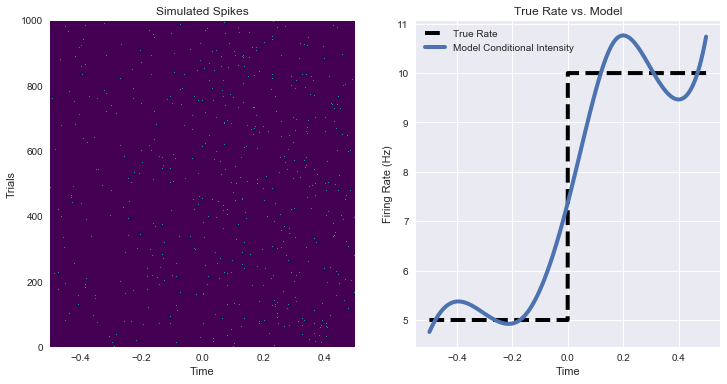
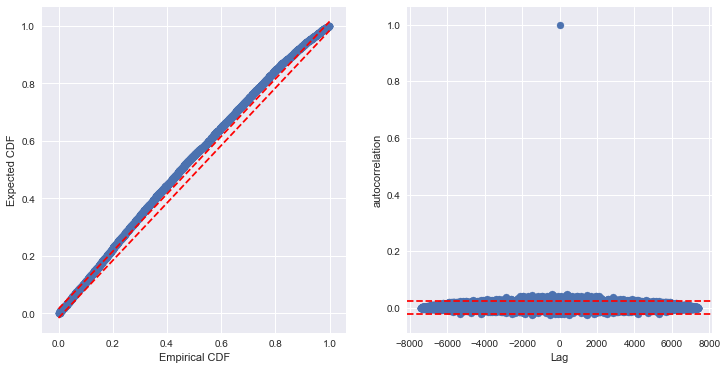
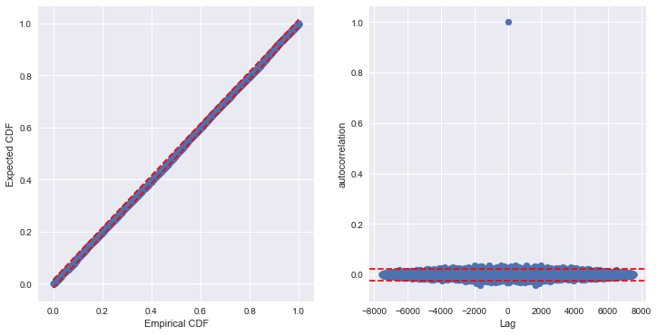
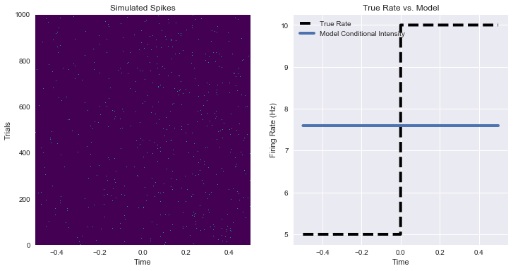
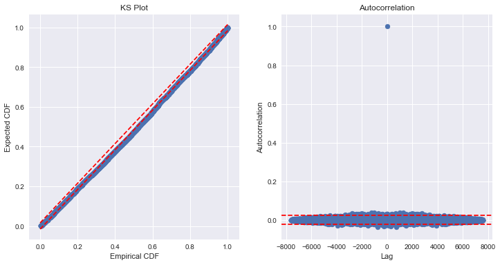

# Time Rescaling
[](https://zenodo.org/badge/latestdoi/106565596)

The `time_rescale` python package allows you to check how well a point process regression model fits neural spiking data by using the time rescaling theorem. The theorem states that point processes can be transformed according to its conditional intensity (instantaneous firing rate) into a unit rate poisson process. So if your model accurately captures the spiking data, you should be able to use the predicted conditional intensity from your model to rescale the spiking data into a unit rate poisson process. See [References](#references) for further details.

`time_rescale` provides convenient methods to rescale and compare your model to the theoretical unit rate poisson process. You can:
+ examine a Kolmogorov-Smirnov plot which compares the rescaled interspike intervals (ISIs) from your model to the theoretical unit rate poisson proces (`plot_ks`).
+ examine a plot of the autocorrelation of the normally transformed rescaled ISIs, which should be independent (`plot_rescaled_ISI_autocorrelation`).
+ handles spiking data with trial structure (label different trials with `trial_id`)
+ adjust for censoring of ISIs caused by short trials (`adjust_for_short_trials`).

See [Example Usage](#example-usage) for more details on how to use the package and associated methods.

### Installation ###
```python
pip install time_rescale
```
OR
```python
conda install -c edeno time_rescale
```

### Dependencies ###
+  numpy
+  scipy
+  matplotlib

### Example Usage ###

#### Fit a model to a simulated inhomogeneous point process
```python
import numpy as np
import matplotlib.pyplot as plt
from patsy import dmatrix
from statsmodels.api import GLM, families

def simulate_poisson_process(rate, sampling_frequency):
    return np.random.poisson(rate / sampling_frequency)

n_time, n_trials = 1500, 1000
sampling_frequency = 1500

# Firing rate starts at 5 Hz and switches to 10 Hz
firing_rate = np.ones((n_time, n_trials)) * 10
firing_rate[:n_time // 2, :] = 5
spike_train = simulate_poisson_process(
    firing_rate, sampling_frequency)
time = (np.arange(0, n_time)[:, np.newaxis] / sampling_frequency *
        np.ones((1, n_trials)))
trial_id = (np.arange(n_trials)[np.newaxis, :]
           * np.ones((n_time, 1)))

# Fit a spline model to the firing rate
design_matrix = dmatrix('bs(time, df=5)', dict(time=time.ravel()))
fit = GLM(spike_train.ravel(), design_matrix,
          family=families.Poisson()).fit()


fig, axes = plt.subplots(1, 2, figsize=(12, 6))

axes[0].pcolormesh(np.unique(time), np.unique(trial_id),
                   spike_train.T, cmap='viridis')
axes[0].set_xlabel('Time')
axes[0].set_ylabel('Trials')
axes[0].set_title('Simulated Spikes')
conditional_intensity = fit.mu

axes[1].plot(np.unique(time), firing_rate[:, 0],
             linestyle='--', color='black',
             linewidth=4, label='True Rate')
axes[1].plot(time.ravel(), conditional_intensity * SAMPLING_FREQUENCY,
             linewidth=4, label='model conditional intensity')
axes[1].set_xlabel('Time')
axes[1].set_ylabel('Firing Rate (Hz)')
axes[1].set_title('True Rate vs. Model')
plt.legend()
```



#### Use time rescaling to analyze goodness of fit

```python
from .time_rescale import TimeRescaling

conditional_intensity = fit.mu
rescaled = TimeRescaling(conditional_intensity,
                         spike_train.ravel(),
                         trial_id.ravel())

fig, axes = plt.subplots(1, 2, figsize=(12, 6))
rescaled.plot_ks(ax=axes[0])
rescaled.plot_rescaled_ISI_autocorrelation(ax=axes[1])
```



#### Use time rescaling to analyze goodness of fit but adjust for short trials

```python
rescaled_adjusted = TimeRescaling(conditional_intensity,
                                  spike_train.ravel(),
                                  trial_id.ravel(),
                                  adjust_for_short_trials=True)
fig, axes = plt.subplots(1, 2, figsize=(12, 6))
rescaled_adjusted.plot_ks(ax=axes[0])
rescaled_adjusted.plot_rescaled_ISI_autocorrelation(ax=axes[1])
```



#### Use a model that doesn't fit well
```python
constant_fit = GLM(spike_train.ravel(),
                   np.ones_like(spike_train.ravel()),
                   family=families.Poisson()).fit()

fig, axes = plt.subplots(1,2, figsize=(12,6))

axes[0].pcolormesh(np.unique(time), np.unique(trial_id),
                   spike_train.T, cmap='viridis')
axes[0].set_xlabel('Time')
axes[0].set_ylabel('Trials')
axes[0].set_title('Simulated Spikes')

conditional_intensity = constant_fit.mu

axes[1].plot(np.unique(time), firing_rate[:, 0],
             linestyle='--', color='black',
             linewidth=4, label='True Rate')
axes[1].plot(time.ravel(), conditional_intensity * SAMPLING_FREQUENCY,
             linewidth=4, label='Model Conditional Intensity')
axes[1].set_xlabel('Time')
axes[1].set_ylabel('Firing Rate (Hz)')
axes[1].set_title('True Rate vs. Model')
plt.legend()
```



```python
bad_rescaled = TimeRescaling(constant_fit.mu,
                             spike_train.ravel(),
                             trial_id.ravel(),
                             adjust_for_short_trials=True)
fig, axes = plt.subplots(1, 2, figsize=(12, 6))
bad_rescaled.plot_ks(ax=axes[0])
axes[0].set_title('KS Plot')
bad_rescaled.plot_rescaled_ISI_autocorrelation(ax=axes[1])
axes[1].set_title('Autocorrelation');
```


### References ###
1. Brown, E.N., Barbieri, R., Ventura, V., Kass, R.E., and Frank, L.M. (2002). The time-rescaling theorem and its application to neural spike train data analysis. Neural Computation 14, 325-346.
2. Wiener, M.C. (2003). An adjustment to the time-rescaling method for application to short-trial spike train data. Neural Computation 15, 2565-2576.
3. Truccolo, W., Eden, U.T., Fellows, M.R., Donoghue, J.P., and Brown, E.N. (2005). A point process framework for relating neural spiking activity to spiking history, neural ensemble, and extrinsic covariate effects. Journal of Neurophysiology 93, 1074-1089.

### Other Toolboxes ###
+ [nStat](https://github.com/iahncajigas/nSTAT) A Matlab toolbox with time rescaling code
